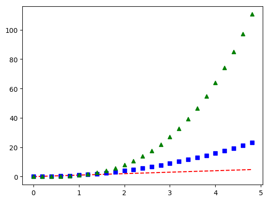

# Integrando o uso de Python e Rmarkdown

Este é o output!!

A função do R `system("python script.py")` irá executar o [script em python](https://github.com/gomesfellipe/python-Rmarkdown/blob/master/CodigoTestePython.py) que gera e salva a imagem [foo.png](https://github.com/gomesfellipe/python-Rmarkdown/blob/master/foo.png), veja:

```{r}
system("python CodigoTestePython.py")
```
Após isso, basta introduzir a imagem com o comando `` que irá aparecer como no exemplo:



Para mais informações sobre Rmarkdown essas cheatsheets podem ajudar:

  * [rmarkdown-cheatsheet-1](https://www.rstudio.com/wp-content/uploads/2015/02/rmarkdown-cheatsheet.pdf)
  * [rmarkdown-cheatsheet-2](https://www.rstudio.com/wp-content/uploads/2016/03/rmarkdown-cheatsheet-2.0.pdf)
  
  Além do [guia de referência](https://www.rstudio.com/wp-content/uploads/2015/03/rmarkdown-reference.pdf) do [documento compartilhado no rpubs](http://rpubs.com/gomes555/reticulate)
  
  
*Motificação*
